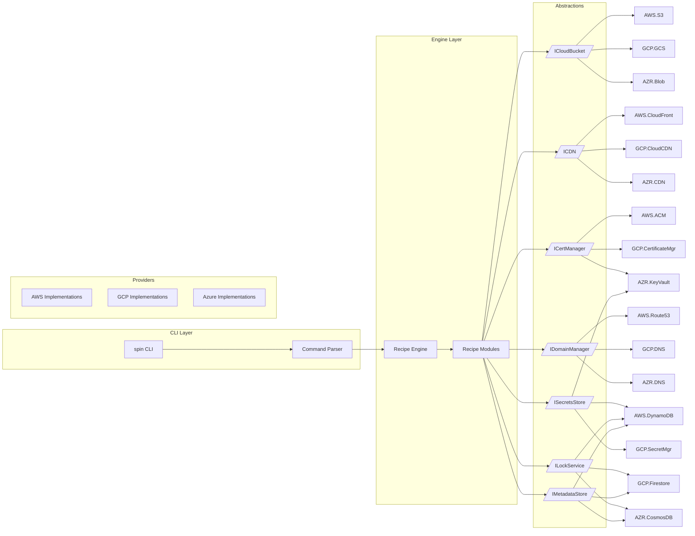

**Spin CLI Technical Documentation**

---

## 1. Overview

**Spin** is a pluggable, provider-agnostic CLI tool for deploying static and dynamic web applications. It uses a modular Recipe Engine, abstract provider interfaces, and layered configuration to support multiple clouds (AWS, GCP, Azure, etc.), while offering feature parity with Vercel’s CLI (deploy, dev, build, alias, domains, certs, logs, rollback, teardown, etc.).

Key features:

* **Interactive project initialization** (`spin init`) with presets and provider selection
* **Deploy** to S3+CloudFront (or any provider-backed bucket/CDN)
* **SSL certificates** management and automatic provisioning
* **DNS & domains** management, including domain/sub-domain transfer to Route 53
* **Env & secrets** stores
* **Deployment metadata, logs & locks** via DynamoDB (or alternative)
* **Teardown**: remove resources per-deployment or globally

---

## 2. CLI Reference

### 2.1 Project-local Commands

| Command                                 | Description                                                  |
| --------------------------------------- | ------------------------------------------------------------ |
| `spin init`                             | Interactive wizard: select recipe, provider, region, presets |
| `spin up [path]` / `spin deploy --prod` | Build & deploy (production if `--prod`)                      |
|                                         |                                                              |
| `spin build`                            | Run build step only                                          |
| `spin list [project]`                   | List deployments                                             |
| `spin inspect <id>`                     | Show details for a deployment                                |
| `spin logs [id] [-f]`                   | View or tail logs                                            |
| `spin alias <id> <domain>`              | Assign a custom domain or subdomain                          |
| `spin rollback <id>`                    | Roll back DNS/alias to a prior deployment                    |
| `spin remove <id>`                      | Remove a deployment                                          |
| `spin promote <id>`                     | Promote a preview to production (alias + DNS)                |
|                                         |                                                              |
| spin purge                              | Remove all resources for a single deployment                 |
| spin purge global                       | Wipe all global resources (state store, locks, logs, config) |

````bash


### 2.2 DNS & Domains

| Command                                         | Description                             |
|-------------------------------------------------|-----------------------------------------|
| `spin domains list`                             | List domains in your account            |
| `spin domains add <domain>`                     | Add a domain                           |
| `spin domains remove <domain>`                  | Remove a domain                        |
| `spin domains transfer <domain> --to-route53`   | Import domain into Route 53             |
| `spin domains transfer-sub <sub.domain> …`      | Import sub-zone into Route 53           |
| `spin dns list [zone]`                          | List DNS records                       |
| `spin dns add <name> <type> <value>`            | Create DNS record                      |
| `spin dns rm <name> <type>`                     | Delete DNS record                      |

### 2.3 Certificates

| Command                                 | Description                               |
|-----------------------------------------|-------------------------------------------|
| `spin certs issue <domain>`             | Request or renew TLS certificate          |
| `spin certs list`                       | List managed certificates                 |
| `spin certs revoke <certId>`            | Revoke a certificate                      |

### 2.4 Environment & Secrets

| Command                                  | Description                                  |
|------------------------------------------|----------------------------------------------|
| `spin env list`                          | List project env vars                        |
| `spin env add <key> [value]`             | Add or update an env var                     |
| `spin env rm <key>`                      | Remove an env var                            |
| `spin env pull [--yes]`                  | Export vars to `.env`                        |
| `spin env push [--environment <name>]`   | Upload local `.env` to remote               |
| `spin secrets ls`                        | List secret keys                             |
| `spin secrets add <key> [value]`         | Store a sensitive var (encrypted)            |
| `spin secrets rm <key>`                  | Delete a secret                              |

### 2.5 User & Teams

| Command                | Description                                 |
|------------------------|---------------------------------------------|
| `spin projects list`   | List projects                               |
| `spin projects create` | Create a new project metadata               |
| `spin projects rm`     | Remove project metadata                     |
| `spin teams list`      | List teams/orgs                             |
| `spin switch [--team]` | Switch active team or provider context      |
| `spin whoami`          | Show authenticated user                     |
| `spin login`           | Authenticate with provider                  |
| `spin logout`          | Clear cached credentials                    |

### 2.6 Global Commands

| Command                       | Description                                                      |
|-------------------------------|------------------------------------------------------------------|
| `spin config [--global]`      | View or interactively edit local (`./.spinrc`) or global (`~/.spinrc`) settings |
| `spin providers`              | List installed provider plugins                                  |
| `spin version`                | Show CLI version                                                 |
| `spin help [command]`         | Show help for any command                                        |
| **`spin teardown --global`**  | Remove all global resources (state, locks, logs, config)         |

---

## 3. Configuration

Spin merges settings in this precedence:
1. CLI flags
2. `./.spinrc` (project-local)
3. `~/.spinrc` (global)
4. Built-in defaults

### 3.1 Global `~/.spinrc`
```yaml
# format: 1
defaultProvider: aws
defaultRegion: us-east-1

stateStore:
  type: dynamodb
table: spin_global_state

secretsStore:
  type: aws-ssm
  pathPrefix: /spin/secrets

lockService:
  type: dynamodb
  table: spin_locks
````

### 3.2 Local `./.spinrc`

```yaml
# format: 1
provider: aws
recipe: SPA_Bucket_CDN

aws:
  region: us-east-1
  bucketName: my-static-site
  useRoute53: true
  autoCert: true

presets:
  loggingTable: spin-deployments
  domains:
    - example.com
    - www.example.com
```

---

## 4. Internal Architecture



**Key flows:**

1. \`\` → interactive prompts → write `./.spinrc`
2. \`\` → merge configs → acquire lock → run recipe steps → upload artifacts → provision infra → write metadata → release lock
3. \`\` → lookup deployment metadata → delete resources in reverse order → update metadata
4. \`\` → delete state store, locks table, logs table, global configs

---

## 5. File Structure

```text
spin-cli/
├── bin/
│   └── spin.js                # CLI entrypoint
├── src/
│   ├── CLI/
│   │   ├── index.ts           # load commands & flags
│   │   └── commands/          # individual command handlers
│   ├── Engine/
│   │   ├── RecipeEngine.ts
│   │   └── RecipeRegistry.ts
│   ├── Recipes/
│   │   └── SPA_Bucket_CDN.ts  # example recipe
│   ├── Providers/
│   │   ├── aws/               # AWS implementations
│   │   │   ├── S3Bucket.ts
│   │   │   ├── CloudFront.ts
│   │   │   └── ...
│   │   ├── gcp/               # GCP implementations
│   │   └── azure/             # Azure implementations
│   ├── Config/
│   │   ├── LocalConfig.ts     # read/write .spinrc
│   │   └── GlobalConfig.ts    # read/write ~/.spinrc
│   └── Utils/                 # logging, error handling, locking
├── templates/                 # built-in project templates
├── test/                      # unit & integration tests
├── .spinrc.template           # sample local config
├── README.md                  # high-level overview
└── package.json
```

---

## 6. Teardown Feature

### 6.1 Single Deployment Teardown

```bash
spin teardown <deployment-id>
```

* **Lookup** metadata for `<deployment-id>` in metadata store
* **Acquire** teardown lock to prevent concurrent deletes
* **Delete** in reverse: DNS records → CDN distribution → Bucket objects & bucket → SSL cert (optional) → metadata entry
* **Release** lock and log completion

### 6.2 Global Teardown

```bash
spin purge --global
```

* **Confirm** destructive action via prompt (`--yes` to skip)
* **Delete**:

  * Global state store (DynamoDB table)
  * Locks table
  * Logs & metadata tables
  * Global config file (`~/.spinrc`)
* **Optionally** remove provider-specific global resources (e.g. IAM roles, policies)

---

**This documentation provides a complete blueprint for developers to implement the Spin CLI with modular providers, recipes, interactive configuration, full command suite (including teardown), and clear file/architecture organization.**
